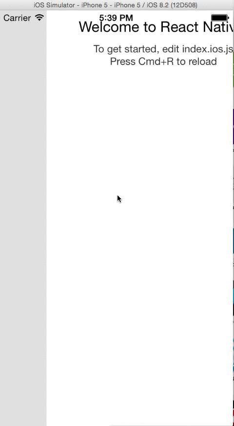

# RNSideMenu

# Preview
<p align="center">
   
</p>

# Examples

Clone this repo and take a look of the *index.ios.js*

# Usage

```javascript
var SideMenu = require('./SideMenu.js');

var App = React.createClass({
  render: function () {
    return (
      <View style={styles.container} >
        <SideMenu 
        frontView={<FrontView />}
        sideView={<SideView />}
        />
      </View>
    );
  }
})
```

# Route map
* [x] Basic views and animations
* [x] Pass frontView and sideView as props
* [ ] Make it as npm module
* [ ] Mutiple directions of side menu
* [ ] Helper actions 
* [ ] Make more examples

# Contribute
#### Pull requests are welcome. 

# About me
Follow me at [@khanght](https://twitter.com/khanght)
